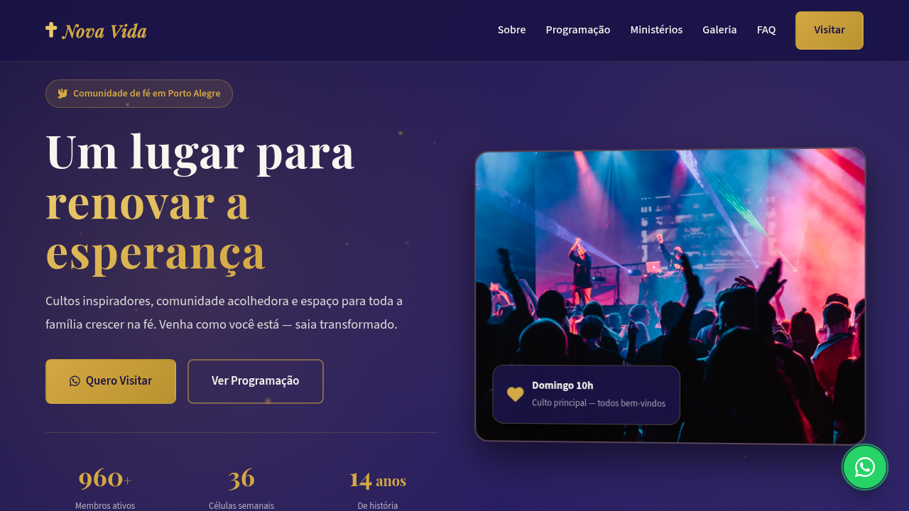

# RoadHome Premium — Locadora de Motor Home

Landing page de alta conversão para locadora de motor home fictícia, desenvolvida com foco em responsividade, acessibilidade e integração WhatsApp para reserva de viagens.

[](https://tofariasti.github.io/aluguel-motorhome-landing/)

## Demo

**Moldura (preview):** [https://tofariasti.github.io/aluguel-motorhome-landing/](https://tofariasti.github.io/aluguel-motorhome-landing/)

**Tela cheia:** [https://tofariasti.github.io/aluguel-motorhome-landing/site/](https://tofariasti.github.io/aluguel-motorhome-landing/site/)

## Screenshots

### Desktop (1280px)


### Tablet (768px)


### Mobile (390px)


## Funcionalidades

- Design responsivo (mobile-first) com identidade verde natureza e laranja pôr do sol
- Integração WhatsApp com formulário estruturado para reserva de motor home
- Animações ao scroll (AOS) + partículas, contadores e hover 3D nos cards
- Grid de frota com 6 motor homes, specs e CTAs de reserva pré-preenchidos
- Planos fim de semana, semanal e mensal com destaque no semanal
- Botão flutuante WhatsApp com pulse
- FAQ accordion interativo
- Acessibilidade WCAG 2.1 AA (skip link, ARIA, contraste, foco visível)
- Respeita `prefers-reduced-motion`
- Moldura iframe com preview desktop/tablet/mobile

## Seções

1. **Hero** — Headline, CTAs, estatísticas animadas e imagem impactante
2. **Categorias** — Compacto, Família e Luxo com preços/dia
3. **Como funciona** — 4 passos da escolha à devolução
4. **Frota em destaque** — 6 motor homes com specs e reserva
5. **O que está incluso** — Kit cozinha, roupa de cama, seguro, suporte 24h
6. **Planos/Tarifas** — Fim de semana, semanal e mensal
7. **Galeria** — 6 fotos da experiência RoadHome
8. **Depoimentos** — 3 avaliações com estrelas
9. **CTA** — Seção de conversão intermediária
10. **FAQ** — CNH, caução, roteiro, retirada/devolução
11. **Contato** — Formulário WhatsApp para reserva
12. **Footer** — Endereço, horários e créditos

## Tecnologias

- HTML5 semântico
- CSS3 (Flexbox/Grid, custom properties)
- JavaScript vanilla (ES6+)
- AOS (Animate On Scroll) v2.3.4
- Font Awesome 6.4
- Google Fonts (Rajdhani + Inter)

## Testes de Responsividade

| Dispositivo | Resolução | Status | Verificado |
|-------------|-----------|--------|------------|
| iPhone SE | 375×667 | ✅ | Menu mobile, formulário, float WhatsApp |
| iPhone 12 Pro | 390×844 | ✅ | Hero, grid frota, CTA above the fold |
| iPhone 14 Pro Max | 428×926 | ✅ | Layout mobile amplo, categorias |
| iPad | 768×1024 | ✅ | Grid 2 colunas, FAQ, planos |
| Desktop HD | 1280×720 | ✅ | Layout completo, moldura preview |
| Desktop FHD | 1920×1080 | ✅ | Max-width container, galeria |

## Acessibilidade

- Semântica HTML5 (`header`, `main`, `footer`, `nav`, landmarks)
- Skip link para conteúdo principal
- Atributos ARIA (`aria-expanded`, `aria-label`, `aria-invalid`, `role="alert"`)
- Contraste WCAG AA — laranja #FF8C33 sobre fundo escuro #0D1B12
- Navegação por teclado (Escape fecha menu mobile)
- Focus states visíveis em todos os interativos
- Alt text descritivo em imagens
- Labels explícitos em formulários
- Font-size mínimo 16px em inputs mobile
- `prefers-reduced-motion`: desabilita AOS, pulse e partículas
- Validação de datas: devolução após retirada

## Como usar

```bash
git clone https://github.com/tofariasti/aluguel-motorhome-landing.git
cd aluguel-motorhome-landing
# Abrir index.html no navegador (preview com moldura iframe)
# Ou abrir site/index.html para tela cheia
python3 -m http.server 8080
```

## Screenshots (geração)

```bash
python3 -m http.server 8765
npm install
npm run screenshots
```

## Personalização

1. **WhatsApp:** altere `WHATSAPP_NUMBER` em `site/assets/js/main.js`
2. **Cores:** edite as variáveis CSS em `:root` no `site/assets/css/style.css`
3. **Textos e frota:** edite `site/index.html`

## Estrutura

```
aluguelmotorhome/
├── index.html              # Preview shell (moldura iframe)
├── assets/css/preview.css
├── assets/js/preview.js
├── site/
│   ├── index.html          # Landing page
│   └── assets/
│       ├── css/style.css
│       └── js/main.js
├── screenshots/
├── scripts/capture-screenshots.mjs
├── .github/workflows/deploy.yml
└── README.md
```

## Autor

**Tiago O. de Farias** — [Farias Digital](https://fariasdigital.com.br/)

- GitHub: [@tofariasti](https://github.com/tofariasti)
- WhatsApp: [(51) 99030-405](https://wa.me/5551989030405)

---

<p align="center">
  <a href="https://tofariasti.github.io/aluguel-motorhome-landing/">🌐 Demo Online</a> ·
  <a href="https://fariasdigital.com.br/">🏢 Site Comercial</a>
</p>
